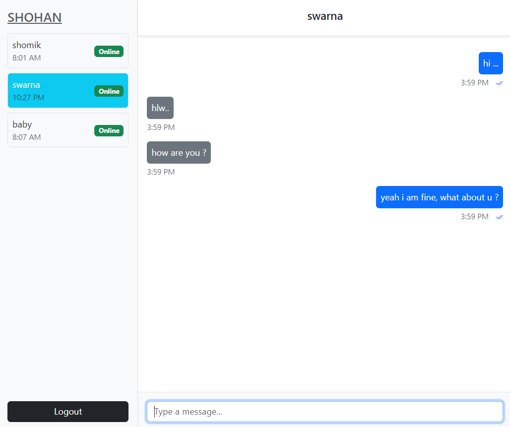

# Chat Application Backend (Spring Boot)

This is the backend service for a real-time chat application. It provides WebSocket support for real-time messaging and REST APIs for user management, message storage, and chat history retrieval. The backend is built using Spring Boot, with WebSocket for real-time communication and a database for persistent message storage.

## Features
- **WebSocket Communication**: Real-time messaging using WebSocket and STOMP protocol.
- **REST API**: For user authentication, fetching users, and retrieving chat history.
- **Message Status**: Tracks message delivery and seen status.
- **Unseen Message Count**: Keeps track of unread messages for each user.
- **Database Persistence**: Chat messages and user data are persisted in the database.

## Technologies Used

- **Spring Boot**: Java framework for creating REST APIs and WebSocket endpoints.
- **Spring WebSocket**: WebSocket support for real-time communication.
- **Spring Data JPA**: For database interaction and ORM (Object Relational Mapping).
- **Postgresql database** for storing user and message data.
- **STOMP**: Protocol for real-time messaging over WebSocket.
- **Maven**: Build and dependency management.

## Application UI

<iframe width="560" height="315" src="https://www.youtube.com/embed/bn2WsqX-uCE?si=TS-r7VAL1Fierur5" title="YouTube video player" frameborder="0" allow="accelerometer; autoplay; clipboard-write; encrypted-media; gyroscope; picture-in-picture; web-share" referrerpolicy="strict-origin-when-cross-origin" allowfullscreen></iframe>
