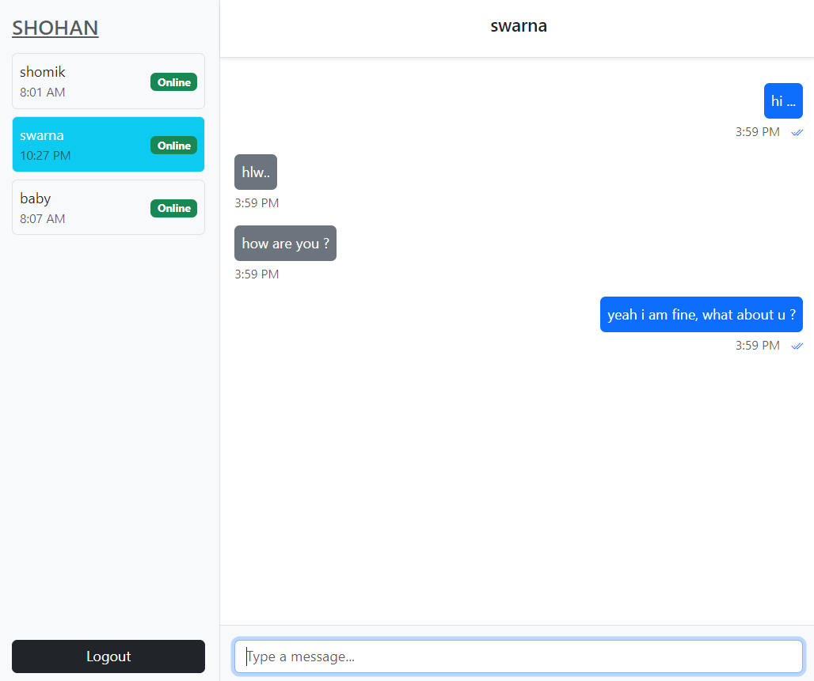

# Chat Application Frontend (Vue.js)

This is a real-time chat application frontend built with Vue.js that allows users to chat with each other. It includes features such as message sending, message seen/delivered status, unread message counters, and real-time user online/offline status. The app communicates with a WebSocket backend to enable real-time messaging.

## Features

- Real-time messaging with WebSocket.
- Online/offline status indication for users.
- Unread message count for users.
- Message status:
    - Single tick for "sent"
    - Double tick (gray) for "delivered"
    - Double tick (blue) for "seen"
- Chat history loading and display.
- User-friendly UI with dynamic user lists and chat panels.
- Responsive design for different screen sizes.
- Simple logout mechanism.

## Screenshot



## Technologies Used

- **Vue.js**: JavaScript framework for building user interfaces.
- **Bootstrap**: For styling and responsive design.
- **Stomp.js**: WebSocket library for real-time messaging using STOMP protocol.
- **SockJS**: WebSocket emulation library for fallback.
- **Axios**: HTTP client for making API requests.


## Setup and Installation

### Prerequisites

Make sure you have the following installed:

- [Node.js](https://nodejs.org/en/) (version >= 20.x.x)
- [npm](https://www.npmjs.com/get-npm) (version >= 10.x.x)

### Installation

1. Clone the repository:

   ```bash
   git clone https://github.com/your-username/chat-frontend.git
   cd chat-frontend
   ```

2. Install dependencies:
    ```bash
    npm install
    ```
### Running the Application
1. Start the development server:
   ```bash
    npm run serve
   ```